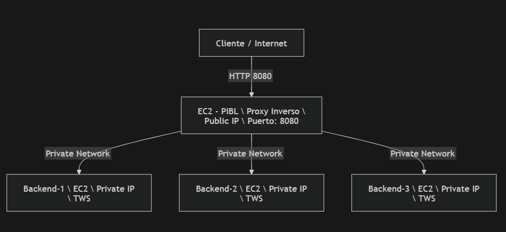

# Despliegue en AWS

## Arquitectura

| Instancia | Rol | IP Privada | IP Pública |
|-----------|-----|------------|------------|
| pibl-server | Proxy Inverso + Balanceador | 172.31.16.223 | 98.88.100.236 |
| backend-1 | Servidor TWS | 172.31.21.179 | — |
| backend-2 | Servidor TWS | 172.31.29.96 | — |
| backend-3 | Servidor TWS | 172.31.26.98 | — |

## Diagrama de Flujo (Mermaid)


## Prerrequisitos

- Cuenta AWS activa con permisos EC2
- Par de llaves `.pem` con `chmod 400`
- Todas las instancias en la misma VPC y subred

## Security Groups

### SG-PIBL
| Tipo | Puerto | Origen | Descripción |
|------|--------|--------|-------------|
| Custom TCP | 8080 | 0.0.0.0/0 | Tráfico de clientes |
| SSH | 22 | Mi IP | Administración |

### SG-Backend
| Tipo | Puerto | Origen | Descripción |
|------|--------|--------|-------------|
| Custom TCP | 8081 | SG-PIBL | Solo desde el PIBL |
| SSH | 22 | Mi IP | Administración |

> ⚠️ En SG-Backend, el origen del puerto 8081 debe ser el ID del SG-PIBL,
> no una IP. Esto garantiza que los backends solo acepten tráfico del PIBL.

## Pasos de despliegue

### 1. Lanzar las instancias EC2

- AMI: Ubuntu Server 22.04 LTS
- Tipo: t2.micro
- Solo el PIBL tiene IP pública habilitada
- Aplicar SG-PIBL al PIBL y SG-Backend a los 3 backends

### 2. Configurar los backends

Conectarse a cada backend vía jump host:

```bash
ssh -i ~/.ssh/pibl-ws-key.pem \
    -J ubuntu@<IP-PUBLICA-PIBL> \
    ubuntu@<IP-PRIVADA-BACKEND>
```

Ejecutar el script de setup:

```bash
bash setup-backend.sh
```

### 3. Configurar el PIBL

```bash
ssh -i ~/.ssh/pibl-ws-key.pem ubuntu@<IP-PUBLICA-PIBL>
bash setup-pibl.sh
```

### 4. Verificar el sistema

```bash
curl -v http://<IP-PUBLICA-PIBL>:8080/
# Esperado: HTTP/1.1 200 OK
```

## Transferencia de binarios sin internet

Si las instancias no tienen acceso a internet para instalar gcc:

```bash
# Compilar en máquina local Linux x86-64
gcc -Wall -Wextra -pthread -g -o tws \
    src/main.c src/server.c src/http_parser.c src/logger.c

# Subir al PIBL
scp -i ~/.ssh/pibl-ws-key.pem ./tws ubuntu@<IP-PUBLICA-PIBL>:~/tws

# Distribuir desde el PIBL a cada backend
scp -i ~/.ssh/pibl-ws-key.pem ~/tws ubuntu@<IP-PRIVADA-BACKEND>:~/PIBL-WS/tws/tws
```

## Notas importantes

- El TWS debe lanzarse con `--port` y `--root` explícitamente.
  Sin estos flags usa valores por defecto y responde 404 a todos los recursos.
- Si las pruebas dan 404 inesperados, limpiar el caché del PIBL:
  `rm -rf ~/PIBL-WS/pibl/cache_storage/ && mkdir ~/PIBL-WS/pibl/cache_storage`
- El caché persiste en disco — sobrevive reinicios del PIBL.