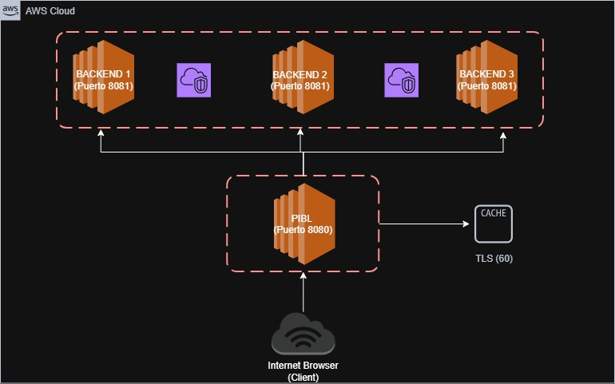

## Arquitectura de Despliegue

El sistema fue desplegado en AWS usando 4 instancias EC2 en la región us-east-1, todas dentro de la misma VPC y subred para comunicación por red privada.

| Instancia | Rol | IP Privada | IP Pública |
|-----------|-----|------------|------------|
| pibl-server | Proxy Inverso + Balanceador | 172.31.16.223 | 98.88.100.236 |
| backend-1 | Servidor TWS | 172.31.21.179 | — |
| backend-2 | Servidor TWS | 172.31.29.96 | — |
| backend-3 | Servidor TWS | 172.31.26.98 | — |

Solo el PIBL tiene IP pública. Los backends únicamente son accesibles desde la red privada, específicamente desde el PIBL.



---

## Configuración de Red y Seguridad

Se crearon dos Security Groups en AWS:

**SG-PIBL** — aplicado a la instancia del proxy:
- Puerto 8080 abierto al público (0.0.0.0/0) para recibir tráfico de clientes
- Puerto 22 restringido a IP del administrador para SSH

**SG-Backend** — aplicado a las 3 instancias de backend:
- Puerto 8081 abierto únicamente desde SG-PIBL, bloqueando acceso directo desde internet
- Puerto 22 restringido a IP del administrador para SSH

---

## Instrucciones de Despliegue

### Prerrequisitos
- Cuenta AWS activa con permisos EC2
- Par de llaves `.pem` configurado con `chmod 400`
- Git instalado en las instancias

### 1. Clonar el repositorio en cada instancia

```bash
sudo apt update && sudo apt install -y git gcc make
git clone https://github.com/[REPO]/pibl-ws.git
```

### 2. Compilar y lanzar el TWS en cada backend
```bash
cd ~/pibl-ws/tws
make
./tws [PUERTO] [LOGFILE] [DOCUMENT_ROOT] &
```
Para verificar que está escuchando:
```bash
ss -tlnp | grep [PUERTO]
```

### 3. Verificar/Configurar el PIBL
Editar ```config-pibl.json``` con las IPs privadas reales de los backends:
```bash
{
    "port": 8080,
    "ttl": 60,
    "servers": [
        {"ip": "172.31.21.179", "port": 8081},
        {"ip": "172.31.29.96", "port": 8081},
        {"ip": "172.31.26.98", "port": 8081}
    ]
}
```

### 4. Compilar y lanzar el PIBL
```bash
cd ~/pibl-ws/pibl
make
screen -dmS pibl ./pibl config-pibl.json
ps aux | grep pibl      #Verificar que está corriendo
```

### 5. Porbar y Verificar el Sistema Completo
curl -v http://98.88.100.236:8080/      # Esperado: HTTP/1.1 200 OK

# Documentación de Pruebas — PIBL-WS
 
## Contexto de las Pruebas
 
Todas las pruebas fueron ejecutadas con el siguiente ambiente:
 
- **Cliente:** Máquina local (Linux/WSL) con curl 8.5.0
- **PIBL:** IP pública `98.88.100.236`, puerto `8080`
- **Backend-1:** IP privada `172.31.21.179`, puerto `8081`
- **Backend-2:** IP privada `172.31.29.96`, puerto `8081`
- **Backend-3:** IP privada `172.31.26.98`, puerto `8081`
- **DocumentRoot:** `/home/ubuntu/www` en cada backend
- **TTL de caché:** 60 segundos
---
 
## Preparación del Ambiente
 
### Recursos web creados en cada backend
 
Se crearon los siguientes archivos en `/home/ubuntu/www/` de los 3 backends:
 
```bash
# Caso 1 — HTML con hipertextos y 1 imagen
cat > /home/ubuntu/www/caso1.html << 'EOF'
<!DOCTYPE html>
<html>
<head><title>Caso 1 - TWS</title></head>
<body>
  <h1>Caso 1: Página con hipertextos e imagen</h1>
  <p><a href="/caso2.html">Ir al Caso 2</a></p>
  <p><a href="/archivo.bin">Descargar archivo</a></p>
  
</body>
</html>
EOF
 
dd if=/dev/urandom bs=1K count=50 > /home/ubuntu/www/foto.jpg
 
# Caso 2 — HTML con múltiples imágenes
cat > /home/ubuntu/www/caso2.html << 'EOF'
<!DOCTYPE html>
<html>
<head><title>Caso 2 - TWS</title></head>
<body>
  <h1>Caso 2: Múltiples imágenes</h1>
  
  
  
  
</body>
</html>
EOF
 
for i in 1 2 3 4; do
  dd if=/dev/urandom bs=1K count=100 > /home/ubuntu/www/img${i}.jpg
done
 
# Caso 3 — Archivo único ~1MB
dd if=/dev/urandom bs=1M count=1 of=/home/ubuntu/www/archivo.bin
 
# Caso 4 — Múltiples archivos ~1MB total
cat > /home/ubuntu/www/caso4.html << 'EOF'
<!DOCTYPE html>
<html>
<head><title>Caso 4 - TWS</title></head>
<body>
  <h1>Caso 4: Múltiples archivos ~1MB total</h1>
  <a href="/parte1.bin">Parte 1</a>
  <a href="/parte2.bin">Parte 2</a>
  <a href="/parte3.bin">Parte 3</a>
  <a href="/parte4.bin">Parte 4</a>
</body>
</html>
EOF
 
for i in 1 2 3 4; do
  dd if=/dev/urandom bs=1K count=256 > /home/ubuntu/www/parte${i}.bin
done
```
 
Los archivos fueron replicados a Backend-2 y Backend-3 usando `scp` a través del PIBL como jump host:
 
```bash
scp -i ~/.ssh/pibl-ws-key.pem \
    -J ubuntu@98.88.100.236 \
    -r ubuntu@172.31.21.179:/home/ubuntu/www \
    /tmp/www-backup
 
scp -i ~/.ssh/pibl-ws-key.pem \
    -J ubuntu@98.88.100.236 \
    -r /tmp/www-backup \
    ubuntu@172.31.29.96:/home/ubuntu/www
 
scp -i ~/.ssh/pibl-ws-key.pem \
    -J ubuntu@98.88.100.236 \
    -r /tmp/www-backup \
    ubuntu@172.31.26.98:/home/ubuntu/www
```
 
### Forma correcta de lanzar el TWS
 
Durante las pruebas se identificó que el TWS debe lanzarse con los argumentos `--port` y `--root` explícitamente. El comando correcto es:
 
```bash
cd ~/PIBL-WS/tws
screen -dmS tws ./tws --port 8081 --root /home/ubuntu/www
```
 
> **Nota:** Lanzarlo como `./tws 8081 /home/ubuntu/tws.log /home/ubuntu/www` hace que el servidor ignore los argumentos y use el DocumentRoot por defecto (`./webapp`), causando 404 en todos los recursos.
 
### Limpiar caché antes de cada prueba
 
```bash
ssh -i ~/.ssh/pibl-ws-key.pem ubuntu@98.88.100.236 \
    "rm -rf ~/PIBL-WS/pibl/cache_storage/*"
```
 
---
 
## PRUEBA 1 — Caso 1: Página web con hipertextos y una imagen
 
**Objetivo:** Verificar que el sistema sirve correctamente una página HTML con enlaces e imagen.
 
**Comando ejecutado:**
```bash
curl -v http://98.88.100.236:8080/caso1.html
```
 
**Resultado obtenido:**
```
HTTP/1.1 200 OK
Content-Type: text/html
Content-Length: 288
Connection: close
 
<!DOCTYPE html>
<html>
<head><title>Caso 1 - TWS</title></head>
<body>
  <h1>Caso 1: Página con hipertextos e imagen</h1>
  <p><a href="/caso2.html">Ir al Caso 2</a></p>
  <p><a href="/archivo.bin">Descargar archivo</a></p>
  
</body>
</html>
```
 
**Resultado:** ✅ PASS — Código 200, HTML completo entregado (288 bytes).
 
---
 
## PRUEBA 2 — Caso 2: Página web con múltiples imágenes
 
**Objetivo:** Verificar que el sistema sirve una página HTML que referencia múltiples imágenes.
 
**Comando ejecutado:**
```bash
curl -v http://98.88.100.236:8080/caso2.html
```
 
**Resultado obtenido:**
```
HTTP/1.1 200 OK
Content-Type: text/html
Content-Length: 283
Connection: close
 
<!DOCTYPE html>
<html>
<head><title>Caso 2 - TWS</title></head>
<body>
  <h1>Caso 2: Múltiples imágenes</h1>
  
  
  
  
</body>
</html>
```
 
**Resultado:** ✅ PASS — Código 200, HTML completo entregado (283 bytes).
 
---
 
## PRUEBA 3 — Caso 3: Archivo único de ~1MB
 
**Objetivo:** Verificar que el sistema transfiere correctamente un archivo binario grande.
 
**Comandos ejecutados:**
```bash
curl -v http://98.88.100.236:8080/archivo.bin -o /tmp/caso3.bin
ls -lh /tmp/caso3.bin
```
 
**Resultado obtenido:**
```
HTTP/1.1 200 OK
Content-Type: application/octet-stream
Content-Length: 1048576
Connection: close
 
100 1024k  100 1024k    0     0  1619k      0
```
 
```
-rw-r--r-- 1 felip felip 1.0M /tmp/caso3.bin
```
 
**Resultado:** ✅ PASS — Código 200, archivo de exactamente 1048576 bytes (1MB) transferido íntegro.
 
---
 
## PRUEBA 4 — Caso 4: Múltiples archivos con total ~1MB
 
**Objetivo:** Verificar que el sistema sirve múltiples archivos correctamente.
 
**Comandos ejecutados:**
```bash
curl -v http://98.88.100.236:8080/caso4.html
 
for i in 1 2 3 4; do
  curl -s "http://98.88.100.236:8080/parte${i}.bin" \
    -o /dev/null \
    -w "parte${i}.bin: %{http_code} — %{size_download} bytes\n"
done
```
 
**Resultado obtenido:**
```
HTTP/1.1 200 OK
Content-Type: text/html
Content-Length: 281
 
parte1.bin: 200 — 262144 bytes
parte2.bin: 200 — 262144 bytes
parte3.bin: 200 — 262144 bytes
parte4.bin: 200 — 262144 bytes
```
 
**Resultado:** ✅ PASS — HTML entregado, 4 archivos de 256KB cada uno (total 1MB).
 
---
 
## PRUEBA 5 — Método GET
 
**Objetivo:** Verificar que el método GET funciona correctamente.
 
**Comando ejecutado:**
```bash
curl -v http://98.88.100.236:8080/caso1.html
```
 
**Resultado:** ✅ PASS — Código 200, recurso entregado con body completo.
 
---
 
## PRUEBA 6 — Método HEAD
 
**Objetivo:** Verificar que HEAD responde con headers correctos y sin body, según RFC 2616.
 
**Comando ejecutado:**
```bash
curl -v -X HEAD http://98.88.100.236:8080/caso1.html
```
 
**Resultado obtenido:**
```
HTTP/1.1 200 OK
Content-Type: text/html
Content-Length: 288
Connection: close
 
curl: (18) transfer closed with 288 bytes remaining to read
```
 
**Resultado:** ✅ PASS — Headers correctos (`Content-Length: 288`), body no enviado. El error `(18)` de curl es esperado — curl anuncia que esperaba 288 bytes pero el servidor correctamente no los envió, cumpliendo el estándar HTTP/1.1.
 
---
 
## PRUEBA 7 — Método POST
 
**Objetivo:** Verificar que el servidor procesa peticiones POST con body.
 
**Comando ejecutado:**
```bash
curl -v -X POST http://98.88.100.236:8080/caso1.html \
  -H "Content-Type: text/plain" \
  -d "campo=valor&otro=dato"
```
 
**Resultado obtenido:**
```
HTTP/1.1 200 OK
Content-Type: text/html
Content-Length: 50
Connection: close
 
<html><body><h1>POST recibido</h1></body></html>
```
 
**Resultado:** ✅ PASS — Código 200, body de 21 bytes procesado correctamente.
 
---
 
## PRUEBA 8 — Código de error 404
 
**Objetivo:** Verificar que el servidor responde 404 para recursos inexistentes.
 
**Comando ejecutado:**
```bash
curl -v http://98.88.100.236:8080/recurso-inexistente.html
```
 
**Resultado obtenido:**
```
HTTP/1.1 404 Not Found
Content-Type: text/html
Content-Length: 48
Connection: close
 
<html><body><h1>404 Not Found</h1></body></html>
```
 
**Resultado:** ✅ PASS — Código 404, respuesta limpia, servidor no crashea.
 
---
 
## PRUEBA 9 — Código de error 400
 
**Objetivo:** Verificar que el servidor responde 400 ante peticiones HTTP malformadas.
 
**Comando ejecutado:**
```bash
echo -e "METODO_INVALIDO / HTTP/1.1\r\nHost: 98.88.100.236\r\n\r\n" | \
  nc 98.88.100.236 8080
```
 
**Resultado obtenido:**
```
HTTP/1.1 400 Bad Request
Content-Type: text/html
Content-Length: 50
Connection: close
 
<html><body><h1>400 Bad Request</h1></body></html>
```
 
**Resultado:** ✅ PASS — Código 400, respuesta limpia, servidor no crashea.
 
---
 
## PRUEBA 10 — Round Robin
 
**Objetivo:** Verificar que el PIBL distribuye las peticiones equitativamente entre los 3 backends.
 
**Metodología:** Se enviaron 9 peticiones con URLs únicas (usando query params) para evitar que el caché interfiera, forzando que cada petición llegue al backend.
 
**Comando ejecutado:**
```bash
# Limpiar caché
ssh -i ~/.ssh/pibl-ws-key.pem ubuntu@98.88.100.236 \
    "rm -rf ~/PIBL-WS/pibl/cache_storage/*"
 
# 9 peticiones únicas
for i in {1..9}; do
  curl -s "http://98.88.100.236:8080/?req=$i" > /dev/null
  echo "Petición $i enviada"
done
```
 
**Verificación en logs de cada backend:**
```bash
# Backend-1
ssh -i ~/.ssh/pibl-ws-key.pem \
    -J ubuntu@98.88.100.236 \
    ubuntu@172.31.21.179 \
    "tail -f /home/ubuntu/PIBL-WS/tws/tws.log"
 
# Backend-2
ssh -i ~/.ssh/pibl-ws-key.pem \
    -J ubuntu@98.88.100.236 \
    ubuntu@172.31.29.96 \
    "tail -f /home/ubuntu/PIBL-WS/tws/tws.log"
 
# Backend-3
ssh -i ~/.ssh/pibl-ws-key.pem \
    -J ubuntu@98.88.100.236 \
    ubuntu@172.31.26.98 \
    "tail -f /home/ubuntu/PIBL-WS/tws/tws.log"
```
 
**Distribución resultante:**
 
| Backend | IP Privada | Peticiones recibidas |
|---------|------------|----------------------|
| backend-1 | 172.31.21.179 | req=2, req=5, req=8 |
| backend-2 | 172.31.29.96 | req=3, req=6, req=9 |
| backend-3 | 172.31.26.98 | req=1, req=4, req=7 |
 
**Resultado:** ✅ PASS — 3 peticiones exactas por backend, rotación en orden perfecto.
 
---
 
## PRUEBA 11 — Caché persistente
 
**Objetivo:** Verificar que el PIBL almacena en disco los recursos solicitados y los sirve desde caché en peticiones subsecuentes.
 
**Comandos ejecutados:**
```bash
# Limpiar caché
ssh -i ~/.ssh/pibl-ws-key.pem ubuntu@98.88.100.236 \
    "rm -rf ~/PIBL-WS/pibl/cache_storage/*"
 
# Petición 1 — debe ir al backend
curl -s http://98.88.100.236:8080/ > /dev/null
 
# Petición 2 — debe servirse desde caché
curl -s http://98.88.100.236:8080/ > /dev/null
 
# Verificar log del PIBL
ssh -i ~/.ssh/pibl-ws-key.pem ubuntu@98.88.100.236 \
    "tail -30 ~/PIBL-WS/pibl/pibl.log"
```
 
**Resultado en log del PIBL:**
```
[2026-05-06 00:02:30] GET /
  Status  : 200
  Fuente  : SERVIDOR    ← primera petición va al backend
 
[2026-05-06 00:02:30] GET /
  Status  : 200
  Fuente  : CACHE       ← segunda petición desde disco
```
 
**Resultado:** ✅ PASS — Primera petición va al backend, segunda servida desde caché en disco.
 
---
 
## PRUEBA 12 — TTL de caché
 
**Objetivo:** Verificar que los recursos en caché expiran correctamente según el TTL configurado (60 segundos).
 
**Comandos ejecutados:**
```bash
# Llenar el caché
curl -s http://98.88.100.236:8080/ > /dev/null
echo "Caché llenado, esperando 60 segundos..."
 
# Esperar TTL
sleep 60
 
# Petición post-TTL — debe volver al backend
curl -v http://98.88.100.236:8080/
 
# Verificar log
ssh -i ~/.ssh/pibl-ws-key.pem ubuntu@98.88.100.236 \
    "tail -10 ~/PIBL-WS/pibl/pibl.log"
```
 
**Resultado en log del PIBL:**
```
[2026-05-06 00:13:02] GET /
  Status  : 200
  Fuente  : SERVIDOR    ← TTL expirado, vuelve al backend
```
 
**Resultado:** ✅ PASS — El caché expiró correctamente a los 60 segundos y la petición fue al backend.
 
---
 
## PRUEBA 13 — Concurrencia
 
**Objetivo:** Verificar que el sistema maneja múltiples clientes simultáneos sin degradación ni crashes.
 
**Comando ejecutado:**
```bash
for i in {1..20}; do
  curl -s "http://98.88.100.236:8080/?c=$i" \
    -o /dev/null \
    -w "Petición $i: %{http_code}\n" &
done
wait
echo "--- Todas completadas ---"
```
 
**Resultado obtenido:**
```
Petición 1: 404
Petición 2: 404
...
Petición 20: 404
--- Todas completadas ---
```
 
> Los códigos 404 son esperados porque `/?c=N` no es un recurso existente. Lo importante es que el servidor respondió a las 20 peticiones simultáneas sin crashear.
 
**Resultado:** ✅ PASS — 20/20 peticiones respondidas concurrentemente, servidor estable.
 
---
 
## Resumen Final
 
| # | Prueba | Resultado |
|---|--------|-----------|
| 1 | Caso 1 — HTML + hipertextos + imagen | ✅ PASS |
| 2 | Caso 2 — HTML + múltiples imágenes | ✅ PASS |
| 3 | Caso 3 — Archivo único ~1MB | ✅ PASS |
| 4 | Caso 4 — Múltiples archivos ~1MB total | ✅ PASS |
| 5 | GET | ✅ PASS |
| 6 | HEAD — sin body | ✅ PASS |
| 7 | POST — body procesado | ✅ PASS |
| 8 | Error 404 | ✅ PASS |
| 9 | Error 400 | ✅ PASS |
| 10 | Round Robin | ✅ PASS |
| 11 | Caché persistente | ✅ PASS |
| 12 | TTL de caché | ✅ PASS |
| 13 | Concurrencia — 20 clientes simultáneos | ✅ PASS |
 
**13/13 pruebas pasadas. Sistema validado completamente.**