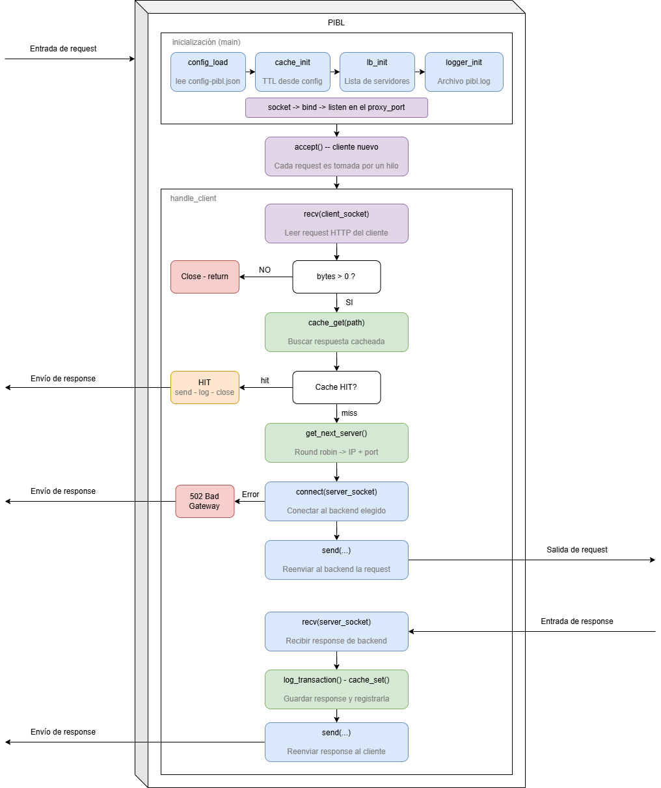

# PIBL - Proxy Inteligente con Balanceo y Cache
Este proyecto implementa un servidor proxy inverso concurrente en C que incluye:

- Balanceo de carga (Round Robin)
- Sistema de cache con TTL
- Registro de logs (logger)
- Manejo concurrente de clientes con hilos (pthreads)

El proxy recibe solicitudes HTTP de clientes, decide si responder desde cache o reenviar la petición a un servidor backend, y devuelve la respuesta al cliente.

## Diagrama de flujo de funcionamiento


## Estructura del proyecto

```
/project
│
├── cache/
│ ├── cache.c
│ └── cache.h
│
├── cache_storage/
│ └── (archivos de almacenamiento de cache en disco)
│
├── config/
│ ├── config.c
│ └── config.h
│
├── load_balancer/
│ ├── load_balancer.c
│ └── load_balancer.h
│
├── logger/
│ ├── logger.c
│ └── logger.h
│
├── config-pibl.json
├── Makefile
├── pibl.c
└── pibl.log
```

El proyecto fue diseñado siguiendo un enfoque modular, separando cada responsabilidad en componentes independientes:

- `cache/` → Manejo del sistema de cache con TTL  
- `load_balancer/` → Selección de servidores (Round Robin)  
- `config/` → Lectura y manejo de configuración desde JSON  
- `logger/` → Registro de transacciones del proxy  
- `cache_storage/` → (Opcional) Persistencia de datos en cache  

Esta división permite:

- Mejor mantenimiento del código  
- Mayor escalabilidad  
- Facilidad para probar cada componente de forma independiente  
- Reutilización de módulos en otros proyectos 

## Funcionamiento Principal

### Inicialización

En `main()` se carga la configuración desde config-pibl.json

Se inicializan:
- Cache (cache_init)
- Balanceador (lb_init)
- Logger (logger_init)
````c
// Cargar configuración desde archivo JSON
if (config_load("./config-pibl.json", &config) != 0) {
    fprintf(stderr, "[ERROR] No se pudo cargar config-pibl.json\n");
    return 1;
}

// Inicializar cache, load balancer y logger
cache_init(config.ttl);
lb_init(config.servers, config.num_servers);
logger_init("pibl.log");
````
> ⚠️ **IMPORTANTE:** Las funciones relacionadas con cache, balanceador, logger y configuración están implementadas en módulos independientes. Para entender su funcionamiento en detalle, revisa la documentación específica de cada uno de estos componentes.

- Se crea el socket del proxy
- Se pone en modo escucha (listen)
````c
// Inicializar sockets
int proxy_socket;
struct sockaddr_in proxy_addr, client_addr;
socklen_t addrlen = sizeof(client_addr);

// Socket del proxy
proxy_socket = socket(AF_INET, SOCK_STREAM, 0);

// Configurar dirección del proxy
proxy_addr.sin_family      = AF_INET;
proxy_addr.sin_addr.s_addr = INADDR_ANY;
proxy_addr.sin_port        = htons(config.proxy_port);

// bind y listen
bind(proxy_socket, (struct sockaddr*)&proxy_addr, sizeof(proxy_addr));
listen(proxy_socket, 5);
````

### Manejo de clientes (concurrencia)

El servidor utiliza un ciclo infinito (`while`) para aceptar conexiones entrantes de clientes.  
Por cada nueva conexión:

1. Se acepta el cliente mediante `accept()`
2. Se crea un hilo (`thread`) independiente
3. Se ejecuta la función `handle_client()`, encargada de procesar la petición

````c
while (1) {
        // Aceptar cliente y crear thread
        ClientArgs *args = malloc(sizeof(ClientArgs));
        args->client_socket = accept(proxy_socket, (struct sockaddr*)&client_addr, &addrlen);

        pthread_t thread;
        pthread_create(&thread, NULL, handle_client, args);
        pthread_detach(thread);
    }
````

Al usar threads permite múltiples conexiones simultáneas.

### Flujo de una petición

### 1. Recepcion de request

Se recibe la petición del cliente.
````c
// Recibir request del cliente
char buffer_request[BUFFER_SIZE]; // variable para almacenar el request del cliente en un buffer de tamaño BUFFER_SIZE (4096 bytes).
int bytes = recv(client_socket, buffer_request, BUFFER_SIZE - 1, 0);
````
### 2. Verificación de cache

Se extraen:
- Método (GET, POST, HEAD)
- path (recurso solicitado)

````c
// Extraer method y path del request
char method[16], path[256];
sscanf(buffer_request, "%15s %255s", method, path);
````

Se revisa si existe el recurso en cache
- Si existe (CACHE HIT):
    - Se responde directamente al cliente
    - Se evita la comunicación con el servidor backend
    - Se registra la transacción en el log
````c
    if (cache_get(path, cached, &cached_size)) {
        // Cache HIT → responder directo sin ir al servidor
        send(client_socket, cached, cached_size, 0);
        log_transaction(method, path, buffer_request, 200, cached_size, 1);
        close(client_socket);
        return NULL;
    }
````
- Si no, se hace un (`CACHE MISS`) y se continua con el flujo normal de la petición hacia el backend.

### 3. Balanceo de carga

En caso de un CACHE MISS, el proxy selecciona un servidor backend utilizando el algoritmo Round Robin usando la función (`get_next_server()`) la cual retorna la IP y el puerto del servidor backend seleccionado.
````c
// Cache MISS → seleccionar servidor con round-robin
Server web_server = get_next_server();
char *server_ip   = web_server.ip;
int   server_port = web_server.port;
````
Una vez seleccionado el servidor, se establece una conexión.
````c
// Crear socket hacia el webserver elegido
int server_socket = socket(AF_INET, SOCK_STREAM, 0);
````
### 4. Conección con el servidor backend
````c
if (connect(server_socket, (struct sockaddr*)&server_addr, sizeof(server_addr)) < 0) {
        fprintf(stderr, "[ERROR] No se pudo conectar al servidor %s:%d\n", server_ip, server_port);

        char *error_response =
            "HTTP/1.1 502 Bad Gateway\r\n"
            "Content-Type: text/html\r\n"
            "Connection: close\r\n"
            "\r\n"
            "<html><body>"
            "<h1>502 Bad Gateway</h1>"
            "<p>No se pudo conectar al servidor backend.</p>"
            "</body></html>\r\n";

        log_transaction(method, path, buffer_request, 502, strlen(error_response), 0);
        send(client_socket, error_response, strlen(error_response), 0);
        close(server_socket);
        close(client_socket);
        return NULL;
    }
````
Si falla:
- Se envía error 502 Bad Gateway
- Se registra en logs

### 5. Reenvío de la request
Cuando se asegura la conexión se reenvía la petición al servidor backend para que este pueda dar una respuesta al cliente.
````c
send(server_socket, buffer_request, bytes, 0);
````

### 6. Recepción de respuesta

Una vez enviada la petición al servidor backend, el proxy comienza a recibir la respuesta en bloques de datos.

````c
// Recibir respuesta en bloques, reenviar al cliente y acumular para cache
int  resp_bytes;
char buffer_response[BUFFER_SIZE];
char cache_buffer[BUFFER_SIZE];
int  cache_size = 0;

while ((resp_bytes = recv(server_socket, buffer_response, BUFFER_SIZE - 1, 0)) > 0) {
    // Reenviar al cliente
    send(client_socket, buffer_response, resp_bytes, 0);

    // Acumular respuesta para guardar en cache (si cabe en el buffer)
    if (cache_size + resp_bytes < BUFFER_SIZE) {
        memcpy(cache_buffer + cache_size, buffer_response, resp_bytes);
        cache_size += resp_bytes;
    }
}
````
La respuesta del servidor se recibe mediante un ciclo `while`, lo que permite procesar datos en bloques.
Esto evita tener que esperar a que toda la respuesta esté disponible antes de enviarla al cliente.

Por cada bloque recibido:

- Se reenvía inmediatamente al cliente
- Se intenta almacenar en un buffer local para su posterior cacheo

Este enfoque mejora el rendimiento y reduce la latencia percibida por el cliente.

### 7. Logging
Para realizar el registro de peticiones en el archivo `pibl.log` primero se tiene que extraer el `status_code` que es necesario en para que la función registre de manera exitosa

````c
// Extraer status code de la respuesta
int status_code = 0;
sscanf(cache_buffer, "HTTP/%*s %d", &status_code);

// Loguear la respuesta
log_transaction(method, path, buffer_request, status_code, cache_size, 0);
````

### 8. Acumulación para cache
Mientras se recibe la respuesta, esta se copia en cache_buffer siempre que no se exceda el tamaño máximo (BUFFER_SIZE).
````c
// Guardar respuesta en cache
if (cache_size > 0) {
    cache_set(path, cache_buffer, cache_size);
}
````

### 9. Cierre de concexiones
Finalmente, se cierran los sockets utilizados:
````c
close(server_socket);
close(client_socket);
return NULL;
````
Esto libera los recursos asociados a la conexión y finaliza la atención del cliente en el hilo correspondiente.

## Formato de configuración (config-pibl.json)
````json
{
  "proxy_port": 8080,
  "ttl": 60,
  "servers": [
    { "ip": "<IP_SERVIDOR_1>", "port": 8081 },
    { "ip": "<IP_SERVIDOR_2>", "port": 8082 },
    { "ip": "<IP_SERVIDOR_3>", "port": 8083 },
  ],
  "num_servers": 3
}
````

## Ejecución
Compilar:
````bash
gcc main.c -o pibl -lpthread
````
Ejecutar:
````bash
./pibl
````

## Características técnicas

| Característica | Implementación            |
|---------------|--------------------------|
| Concurrencia  | pthreads                 |
| Balanceo      | Round Robin              |
| Cache         | TTL (tiempo de vida)     |
| Protocolo     | HTTP (básico)            |
| Logging       | Archivo (`pibl.log`)     |

> ⚠️ **Nota:** El sistema está diseñado para fines académicos y soporta únicamente HTTP básico, sin manejo completo de headers avanzados ni HTTPS.